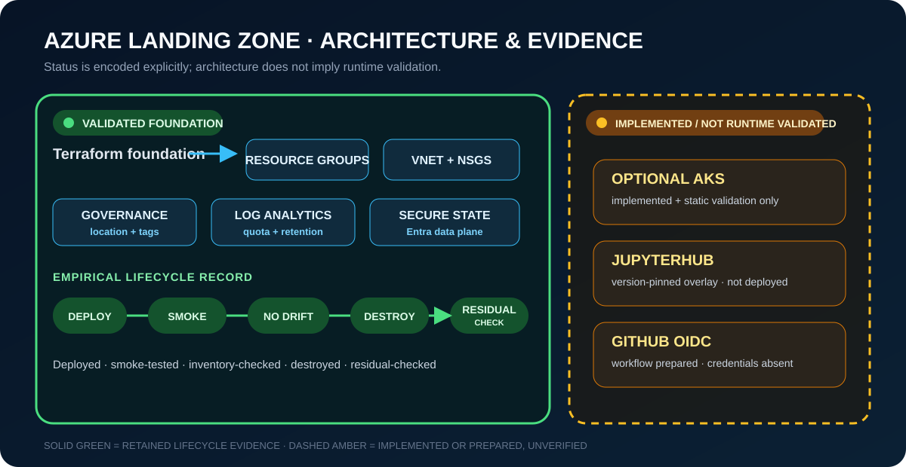
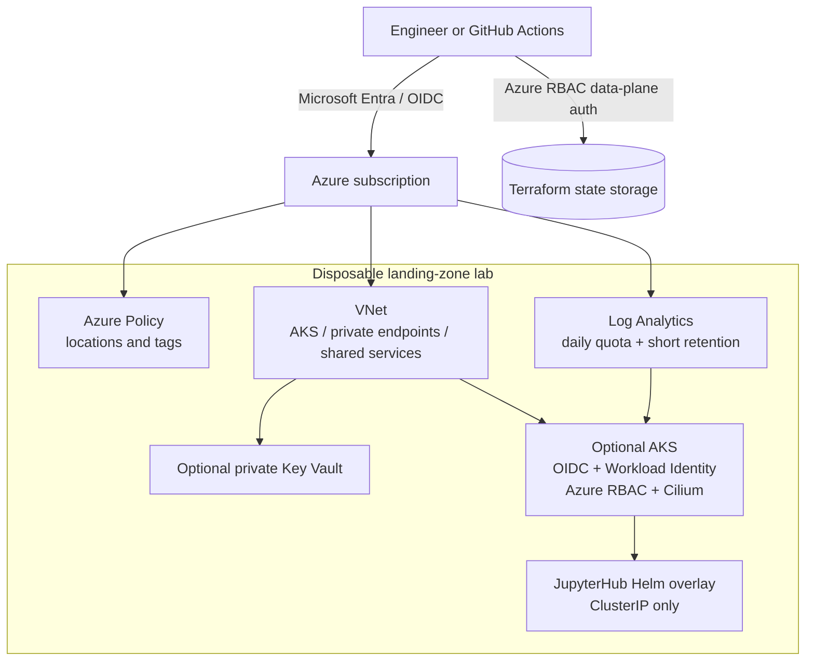

# Azure Data Landing Zone Platform

> A Terraform-based Azure cloud platform lab combining governance, networking, secure state, and an empirically validated deploy–destroy lifecycle.

The foundation path was deployed, smoke-tested, verified for no drift,
destroyed, and residual-checked. AKS, Entra-integrated AKS administration,
JupyterHub, GitHub OIDC, and GitHub-controlled deployment remain implemented,
documented, or prepared but not runtime-validated.

[](https://github.com/goozcena-gnl/azure-data-landing-zone-platform/actions/workflows/validate.yml)
[](https://github.com/goozcena-gnl/azure-data-landing-zone-platform/actions/workflows/dependency-review.yml)
[](https://github.com/goozcena-gnl/azure-data-landing-zone-platform/releases/latest)
[](LICENSE)

Evidence: [foundation lifecycle record](docs/validation/2026-07-18-foundation-lifecycle.md) and [test matrix](docs/validation/test-matrix.md).

## Architecture

<p align="center">
  
</p>

<p align="center"><sub><strong>Architecture + evidence boundary.</strong> Solid green denotes the empirically validated foundation lifecycle; the dashed amber area is implemented or prepared but was not runtime-exercised.</sub></p>



Detailed design: [`docs/architecture/overview.md`](docs/architecture/overview.md).
For a concise problem-to-trade-offs review, use the
[`docs/interview-walkthrough.md`](docs/interview-walkthrough.md) route. The
complete publishable tree is recorded in
[`docs/repository-tree.md`](docs/repository-tree.md).

## Platform scope

Key capabilities:

- secure Terraform state bootstrap on Azure Storage using Microsoft Entra data-plane authorization;
- modular resource groups, VNet/subnets, NSGs, Log Analytics, and optional private Key Vault;
- Azure Policy definitions and assignments for locations and required tags;
- optional AKS with Microsoft Entra Azure RBAC, disabled local accounts, OIDC, Workload Identity, Azure CNI Overlay, and Cilium;
- JupyterHub represented as a version-pinned Helm overlay rather than vendored upstream source;
- pull-request validation plus OIDC-ready plan/apply and destroy workflows designed for protected environments;
- explicit evidence levels: implemented, statically validated, planned, deployed, smoke-tested, or not run.

| Capability | Default | Current evidence |
| --- | ---: | --- |
| Resource groups, VNet, NSGs, Log Analytics | Enabled | Implemented, statically validated, deployed, smoke-tested, destroyed |
| Tag/location policies | Enabled | Implemented, statically validated, deployed, inventory-checked, destroyed |
| Private Key Vault | Disabled | Implemented; not deployed |
| AKS | Disabled | Implemented and statically validated; preflight added; not deployed |
| JupyterHub | Disabled/manual after AKS | Overlay implemented; not deployed |
| GitHub OIDC deployment | Manual | Workflows and guides prepared; environments/credentials absent; not exercised |
| Databricks, Synapse, SQL, Data Factory, VM | Excluded | Historical prototypes, not validated here |
| Azure Naming Tool | Externalized | Upstream dependency only |

## Architecture and decisions

- State configuration uses `use_azuread_auth = true`; no storage key is written to files.
- Foundation-only deployment is the default low-cost path.
- AKS local accounts are disabled and administration requires a Microsoft Entra group.
- Kubernetes credentials are never Terraform outputs; a helper writes an ignored, isolated kubeconfig.
- GitHub Actions uses OIDC instead of a reusable Azure client secret.
- Upstream source trees are removed and replaced by pinned dependencies or attribution notes.
- Destruction and Azure inventory verification are mandatory before claiming lab validation.

See the [architecture overview](docs/architecture/overview.md),
[accepted decision records](docs/decisions/),
[`SECURITY.md`](SECURITY.md), and the
[security exception register](docs/security/scan-exceptions.md).

## Repository structure

```text
.github/                    PR, dependency, deployment, and destroy workflows
.azuredevops/               Preserved Azure DevOps validation pipeline
infra/bootstrap/            One-time remote-state foundation
infra/landing-zone/         Deployable lab root module
infra/modules/              Foundation, governance, and AKS modules
platform/jupyter/           Project-owned JupyterHub Helm overlay
platform/naming-tool/       Attribution and future integration notes
scripts/                    Validation, plan, apply, smoke-test, and teardown
tests/                      Publication-policy checks
docs/                       Architecture, security, lab, migration, and evidence
```

## Validation and limitations

### Prerequisites

Static validation:

- Git and Bash;
- Terraform `1.15.8`;
- Python 3.11+, `jq`, and `requirements-dev.txt`;
- TFLint `0.63.1` with AzureRM rules;
- Make, ShellCheck, and Markdownlint CLI.

Azure deployment additionally requires Azure CLI, an Azure subscription, suitable quota/permissions, and `kubectl`/Helm for optional AKS validation. WSL 2 or Linux is recommended on Windows.

### Static validation

For reproducible WSL 2, Linux, and VS Code Dev Container setup, use the
[local-development guide](docs/local-development.md).

```bash
git clone <REPOSITORY_URL>
cd azure-data-landing-zone-platform
bash scripts/bootstrap-local.sh
source .venv/bin/activate
export PATH="$HOME/.local/bin:$PATH"
make doctor
make test-strict
```

These commands do not deploy Azure resources.

### Empirical validation

Evidence uses explicit statuses:

- `PASS`: command executed and evidence supports success;
- `FAIL`: command executed and evidence supports failure;
- `BLOCKED`: an external permission, credential, network, or tool prevented execution;
- `NOT RUN`: not attempted;
- `NOT APPLICABLE`: outside the retained scope.

The [test matrix](docs/validation/test-matrix.md) and
[validated lifecycle record](docs/validation/2026-07-18-foundation-lifecycle.md)
record a reviewed `34 add / 0 change / 0 destroy` plan, exact-plan apply,
no-drift refresh, smoke tests, a reviewed `34 destroy` plan, exact destruction,
residual checks, and separate backend deletion.

### Current limitations

AKS was blocked in the assessed subscription/region by the configured SKU,
unsuitable alternatives/quota, and the absence of an eligible Entra admin
group. No fallback was selected. GitHub environments and OIDC credentials are
absent. The active `Protect main` ruleset enforces checks and pull requests,
but the sole-maintainer baseline requires zero approving reviews. See
[`docs/known-limitations.md`](docs/known-limitations.md) for the complete,
current boundaries.

## Deployment and teardown

### Foundation deployment

```bash
az login
az account set --subscription "<SUBSCRIPTION_ID>"

cp infra/bootstrap/terraform.tfvars.example infra/bootstrap/terraform.tfvars
# Edit placeholders and trusted public IPv4 address.
terraform -chdir=infra/bootstrap init
terraform -chdir=infra/bootstrap plan -out=bootstrap.tfplan # review before apply
terraform -chdir=infra/bootstrap apply bootstrap.tfplan
terraform -chdir=infra/bootstrap output -raw backend_hcl > infra/landing-zone/backend.hcl

cp infra/landing-zone/terraform.tfvars.example infra/landing-zone/terraform.tfvars
# Edit placeholders. Keep enable_aks=false initially.
make plan-lab
# Review artifacts/lab-plan.txt.
make deploy-lab
make smoke-test
```

Full runbook: [`docs/lab/deployment.md`](docs/lab/deployment.md).

### Optional AKS and JupyterHub

Before enabling AKS, verify current regional SKU availability, quota, Kubernetes support, and pricing. Configure a Microsoft Entra admin group and an authorized API CIDR:

```bash
bash ./scripts/aks-preflight.sh \
  --location "<azure-region>" \
  --vm-size "<explicit-vm-sku>" \
  --node-count 1 \
  --enable-aks true \
  --enable-jupyter false \
  --admin-group-id "<entra-security-group-object-id>"
```

Only after a passing preflight and a newly reviewed exact plan:

```bash
bash ./scripts/get-aks-credentials.sh
export KUBECONFIG="$PWD/artifacts/kubeconfig-lab"
bash ./scripts/deploy-jupyter.sh
make smoke-test
```

The JupyterHub lab uses dummy authentication and a `ClusterIP` service. It must not be exposed to untrusted networks.

### Teardown

```bash
export TF_VAR_name_prefix="<YOUR_PREFIX>"
make destroy-lab
```

The backend is destroyed separately only after every component state is clean. See [`docs/lab/destroy.md`](docs/lab/destroy.md).

### Cost controls

AKS is opt-in and defaults to one system node on the Free management tier, but VMs, disks, load balancing, logs, networking, and egress remain billable. Log Analytics uses a 1 GB/day quota and 30-day default retention. Create an Azure Budget and destroy the lab promptly. Broad planning envelopes and mandatory recalculation steps are documented in [`docs/lab/cost-control.md`](docs/lab/cost-control.md).

## Roadmap

1. Maintain reproducible packaging and independently verify future release
   assets.
2. Maintain pinned dependencies through reviewed Dependabot pull requests.
3. Scope v0.2.0 work for GitHub OIDC, an explicit AKS
   region/SKU/quota/admin-group decision, and optional JupyterHub validation.

## Authorship and license

Project-owned Terraform, refactoring, automation, and documentation are MIT licensed. Azure Naming Tool, JupyterHub, Jupyter Docker Stacks, Terraform, Checkov, TFLint, and other dependencies remain the work of their respective authors and retain their own licenses.

## Maintainer and publication history

This public repository was reconstructed from a broader Cloud/DevOps training
and delivery workspace. Unsafe generated artifacts, credentials, scanner
outputs, binaries, and copied upstream repositories were excluded; the useful
project-owned Terraform architecture, automation, and documentation were
retained. The historical repository remains private and unrelated through
GitHub fork/network metadata.

See the [publication audit summary](docs/security/publication-audit-summary.md)
for the sanitization evidence and
[`docs/github-publication.md`](docs/github-publication.md) for the maintained
release procedure. The [OIDC](docs/github/oidc-setup.md),
[environment](docs/github/environments.md), and
[repository-setting](docs/github/repository-settings.md) guides document the
prepared GitHub path. Third-party ownership boundaries are recorded in
[`docs/third-party-attribution.md`](docs/third-party-attribution.md).
