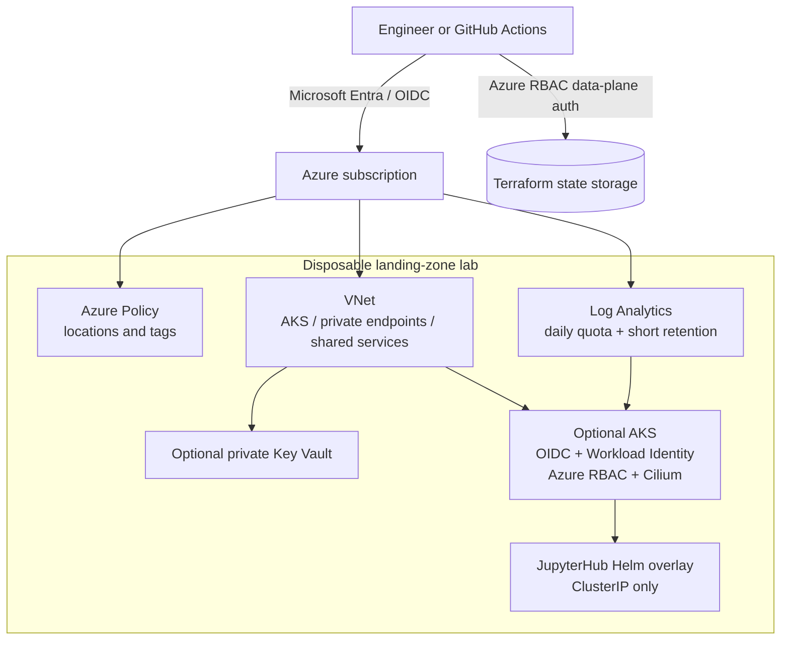

# Azure Data Landing Zone Platform

A portfolio-oriented Azure landing-zone lab demonstrating modular Terraform, governance, networking, observability, AKS, workload identity, secure state management, and reviewed CI/CD without presenting an unverified lab as production-ready.

> **Status:** sanitized engineering baseline. Local validation is recorded in [`docs/validation/execution-report.md`](docs/validation/execution-report.md). Azure plan, deployment, smoke tests, and destruction require an authenticated personal subscription and remain unclaimed until objective evidence is added.

## Project value

The repository refactors a learning-and-delivery workspace created during Cloud/DevOps training. The source archive mixed project code, reports, generated Terraform artifacts, credentials, scanner outputs, downloaded binaries, and complete upstream repositories. The public version preserves the useful architecture while removing unsafe or misleading content.

Key capabilities:

- secure Terraform state bootstrap on Azure Storage using Microsoft Entra data-plane authorization;
- modular resource groups, VNet/subnets, NSGs, Log Analytics, and optional private Key Vault;
- Azure Policy definitions and assignments for locations and required tags;
- optional AKS with Microsoft Entra Azure RBAC, disabled local accounts, OIDC, Workload Identity, Azure CNI Overlay, and Cilium;
- JupyterHub represented as a pinned Helm overlay rather than vendored upstream source;
- pull-request validation plus protected plan/apply and destroy workflows;
- explicit evidence levels: implemented, statically validated, planned, deployed, smoke-tested, or not run.

## Architecture



Detailed design: [`docs/architecture/overview.md`](docs/architecture/overview.md). The complete publishable tree is recorded in [`docs/repository-tree.md`](docs/repository-tree.md).

## Repository structure

```text
.github/                    PR, dependency, deployment, and destroy workflows
.azuredevops/               Preserved Azure DevOps validation pipeline
infra/bootstrap/            One-time remote-state foundation
infra/landing-zone/         Deployable lab root module
infra/modules/              Foundation, governance, and AKS modules
platform/jupyter/           Project-owned JupyterHub Helm overlay
platform/naming-tool/       Attribution and future integration notes
scripts/                    Validation, plan, apply, smoke-test, and teardown
tests/                      Publication-policy checks
docs/                       Architecture, security, lab, migration, and evidence
```

## Scope and evidence

| Capability | Default | Current evidence |
| --- | ---: | --- |
| Resource groups, VNet, NSGs, Log Analytics | Enabled | Implemented; local static checks |
| Tag/location policies | Enabled | Implemented; Azure behavior not yet verified |
| Private Key Vault | Disabled | Implemented; not deployed |
| AKS | Disabled | Implemented; not deployed |
| JupyterHub | Manual after AKS | Overlay implemented; not deployed |
| Databricks, Synapse, SQL, Data Factory, VM | Excluded | Historical prototypes, not validated here |
| Azure Naming Tool | Externalized | Upstream dependency only |

## Security decisions

- State configuration uses `use_azuread_auth = true`; no storage key is written to files.
- Foundation-only deployment is the default low-cost path.
- AKS local accounts are disabled and administration requires a Microsoft Entra group.
- Kubernetes credentials are never Terraform outputs; a helper writes an ignored, isolated kubeconfig.
- GitHub Actions uses OIDC instead of a reusable Azure client secret.
- Upstream source trees are removed and replaced by pinned dependencies or attribution notes.
- Destruction and Azure inventory verification are mandatory before claiming lab validation.

See [`SECURITY.md`](SECURITY.md), [`docs/security/scan-exceptions.md`](docs/security/scan-exceptions.md), and [`docs/decisions/`](docs/decisions/).

## Prerequisites

Static validation:

- Git and Bash;
- Terraform `1.15.8`;
- Python 3.11+ and `requirements-dev.txt`;
- TFLint `0.63.1` with AzureRM rules;
- Make, ShellCheck, and Markdownlint CLI.

Azure deployment additionally requires Azure CLI, an Azure subscription, suitable quota/permissions, and `kubectl`/Helm for optional AKS validation. WSL 2 or Linux is recommended on Windows.

## Static validation

```bash
git clone <REPOSITORY_URL>
cd azure-data-landing-zone-platform
python3 -m venv .venv
source .venv/bin/activate
python3 -m pip install -r requirements-dev.txt
make lint
make validate
make security
make docs-check
```

These commands do not deploy Azure resources.

## Low-cost deployment path

```bash
az login
az account set --subscription "<SUBSCRIPTION_ID>"

cp infra/bootstrap/terraform.tfvars.example infra/bootstrap/terraform.tfvars
# Edit placeholders and trusted public IPv4 address.
terraform -chdir=infra/bootstrap init
terraform -chdir=infra/bootstrap plan -out=bootstrap.tfplan
terraform -chdir=infra/bootstrap apply bootstrap.tfplan
terraform -chdir=infra/bootstrap output -raw backend_hcl > infra/landing-zone/backend.hcl

cp infra/landing-zone/terraform.tfvars.example infra/landing-zone/terraform.tfvars
# Edit placeholders. Keep enable_aks=false initially.
make plan-lab
# Review artifacts/lab-plan.txt.
make deploy-lab
make smoke-test
```

Full runbook: [`docs/lab/deployment.md`](docs/lab/deployment.md).

## Optional AKS and JupyterHub

Before enabling AKS, verify current regional SKU availability, quota, Kubernetes support, and pricing. Configure a Microsoft Entra admin group and an authorized API CIDR. After deployment:

```bash
bash ./scripts/get-aks-credentials.sh
export KUBECONFIG="$PWD/artifacts/kubeconfig-lab"
bash ./scripts/deploy-jupyter.sh
make smoke-test
```

The JupyterHub lab uses dummy authentication and a `ClusterIP` service. It must not be exposed to untrusted networks.

## Validation statuses

- `PASS`: command executed and evidence supports success;
- `FAIL`: command executed and evidence supports failure;
- `BLOCKED`: an external permission, credential, network, or tool prevented execution;
- `NOT RUN`: not attempted;
- `NOT APPLICABLE`: outside the retained scope.

Test matrix: [`docs/validation/test-matrix.md`](docs/validation/test-matrix.md).

## Teardown

```bash
export TF_VAR_name_prefix="<YOUR_PREFIX>"
make destroy-lab
```

The backend is destroyed separately only after every component state is clean. See [`docs/lab/destroy.md`](docs/lab/destroy.md).

## Cost controls

AKS is opt-in and defaults to one system node on the Free management tier, but VMs, disks, load balancing, logs, networking, and egress remain billable. Log Analytics uses a 1 GB/day quota and 30-day default retention. Create an Azure Budget and destroy the lab promptly. Broad planning envelopes and mandatory recalculation steps are documented in [`docs/lab/cost-control.md`](docs/lab/cost-control.md).

## Known limitations

- No real Azure plan/apply evidence is included yet.
- Provider lock files are not generated because Terraform/provider downloads were unavailable in the audit environment; generate and commit them during the private pilot.
- The policies are simple portfolio controls, not an enterprise policy initiative.
- Private AKS connectivity/DNS is not fully built by this personal-lab baseline.
- AKS provisioning and Helm workloads are intentionally separate phases.
- Historical data-platform services were excluded because they were costly, incomplete, or non-reproducible.
- GitHub Actions are pinned to reviewed immutable commit SHAs; Dependabot should propose controlled updates.

## Roadmap

1. Run CI in a private GitHub pilot.
2. Execute foundation-only plan/apply/smoke-test/destroy.
3. Add sanitized evidence.
4. Enable AKS only after cost and quota review.
5. Add Terraform tests after the empirical lab is stable.

## Authorship and license

Project-owned Terraform, refactoring, automation, and documentation are MIT licensed. Azure Naming Tool, JupyterHub, Jupyter Docker Stacks, Terraform, Checkov, TFLint, and other dependencies remain the work of their respective authors and retain their own licenses.

## Publication

Use the private-pilot sequence, repository metadata, protection rules, and exact Git commands in [`docs/github-publication.md`](docs/github-publication.md). Third-party ownership boundaries are recorded in [`docs/third-party-attribution.md`](docs/third-party-attribution.md).
